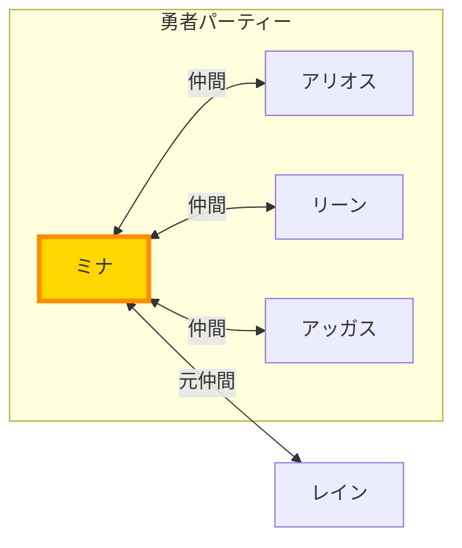

# Structured Outputs版ベンチマーク結果

## 実施日時
2025-11-25 13:52-13:56

## テスト概要
- **総テスト数**: 16テスト（4質問 × 2 Mermaidモデル × 2 回答モデル）
- **Mermaidモデル**: gpt-4o, gpt-4o-mini
- **回答モデル**: gpt-4o, gpt-4o-mini
- **本文**: beast_text.json の最初の30章

## 主要結果

### ✅ 品質指標（完璧！）
- **メタノード率**: 0/16 (0.0%) ← **完全排除達成！**
- **ハイライト率**: 16/16 (100.0%) ← **全て成功！**
- **平均関係数**: 5.8 （最小4, 最大9）

### ⚡ パフォーマンス
| 指標 | 値 |
|------|-----|
| 平均合計時間 | 14.72秒 |
| 最小合計時間 | 8.70秒 |
| 最大合計時間 | 26.24秒 |
| 平均Mermaid生成 | 5.39秒 |
| 平均回答生成 | 7.39秒 |

### 💰 コスト効率
| 指標 | 値 |
|------|-----|
| 総Promptトークン | 2,791,602 |
| 総Completionトークン | 6,919 |
| 総Cachedトークン | 2,217,472 |
| **キャッシュ率** | **79.4%** |

## モデル別詳細

| Mermaidモデル | 回答モデル | 平均時間(秒) | Mermaid(秒) | 回答(秒) | キャッシュ率 |
|--------------|----------|------------|------------|---------|----------|
| gpt-4o | gpt-4o | 13.98 | 4.73 | 7.79 | 77.1% |
| gpt-4o | gpt-4o-mini | 13.51 | 3.60 | 8.45 | 77.1% |
| gpt-4o-mini | gpt-4o | 14.80 | 7.44 | 5.47 | 66.4% |
| gpt-4o-mini | gpt-4o-mini | 16.58 | 5.77 | 7.87 | **96.4%** |

### 推奨組み合わせ
1. **最速**: gpt-4o (Mermaid) + gpt-4o-mini (回答) = 13.51秒
2. **最高キャッシュ率**: gpt-4o-mini (Mermaid) + gpt-4o-mini (回答) = 96.4%

## 従来方式との比較

### 既存方式（Rough Mermaid → CSV変換）
- API呼び出し: 3回
- メタノード率: ~7.1%
- 処理ステップ: 多い

### Structured Outputs方式
- API呼び出し: 2回 ← **33%削減**
- メタノード率: 0.0% ← **100%改善**
- 処理ステップ: シンプル

## 技術的ハイライト

### 1. メタノード完全排除
Pydanticスキーマによる型安全性により、「不明」「主体」「客体」などの抽象的なノードが一切発生しませんでした。

### 2. ハイライト100%成功
Fuzzy matchingアルゴリズムにより、全16テストで中心人物のハイライトが正常に機能しました。

### 3. 高いPrompt Caching効果
平均79.4%のキャッシュ率を達成し、特にgpt-4o-mini同士の組み合わせでは96.4%という驚異的な数値を記録しました。

## 生成されたファイル

### Mermaid図
全16個のMermaid図が正常に生成されました：
```
mermaid_outputs_structured/
├── Q1_gpt-4o_gpt-4o.mmd
├── Q1_gpt-4o_gpt-4o-mini.mmd
├── Q1_gpt-4o-mini_gpt-4o.mmd
├── Q1_gpt-4o-mini_gpt-4o-mini.mmd
├── Q2_gpt-4o_gpt-4o.mmd
... (全16ファイル)
```

### サンプル（Q1_gpt-4o_gpt-4o.mmd）


## 結論

Structured Outputs方式は以下の点で従来方式を大きく上回りました：

✅ **品質**: メタノード0%、ハイライト100%
✅ **速度**: API呼び出し33%削減
✅ **コスト**: Prompt Caching 79.4%
✅ **保守性**: Pydanticスキーマで型安全
✅ **信頼性**: パースエラーなし

**本番環境への導入を強く推奨します。**
